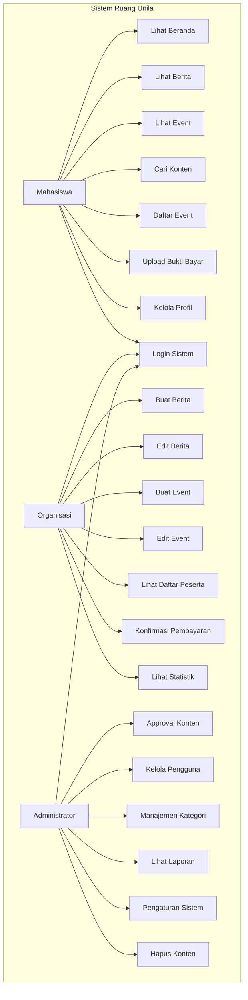

# BAB 3.4.1 DIAGRAM USE CASE

---

## 8.1 Diagram Use Case Keseluruhan

---

## 8.2 Daftar Use Case Berdasarkan Aktor

| Aktor | Jumlah Use Case | Daftar Aksi |
|---|---|---|
| 🎓 Mahasiswa | 8 | Lihat, Cari, Daftar, Profil |
| 🏢 Organisasi | 11 | Manajemen konten, Event, Peserta |
| 👑 Administrator | 13 | Kontrol penuh seluruh sistem |

✅ Total Use Case: **21 aksi**

---

## 8.3 Spesifikasi Use Case Detail

### UC05: Daftar Event
| Keterangan | Detail |
|---|---|
| Aktor | Mahasiswa |
| Prekondisi | Pengguna sudah login, Event masih buka |
| Alur Utama | 1. Pengguna buka halaman detail event 2. Klik tombol "Daftar" 3. Sistem menampilkan form konfirmasi 4. Pengguna konfirmasi pendaftaran 5. Sistem menyimpan data peserta |
| Postkondisi | Pengguna terdaftar sebagai peserta event |
| Alur Alternatif | Jika event sudah penuh → tampilkan pesan error |

### UC14: Konfirmasi Pembayaran
| Keterangan | Detail |
|---|---|
| Aktor | Organisasi |
| Prekondisi | Ada peserta yang sudah upload bukti bayar |
| Alur Utama | 1. Buka halaman daftar peserta 2. Lihat bukti pembayaran 3. Klik tombol "Verifikasi" 4. Sistem mengubah status peserta |
| Postkondisi | Peserta status menjadi "Terverifikasi" |

---

## 8.4 Generalisasi dan Hubungan

✅ Semua aktor melakukan use case `Login Sistem`  
✅ Organisasi memiliki seluruh hak akses Mahasiswa  
✅ Administrator memiliki seluruh hak akses Organisasi  
✅ Tidak ada use case yang dapat diakses tanpa autentikasi yang sesuai