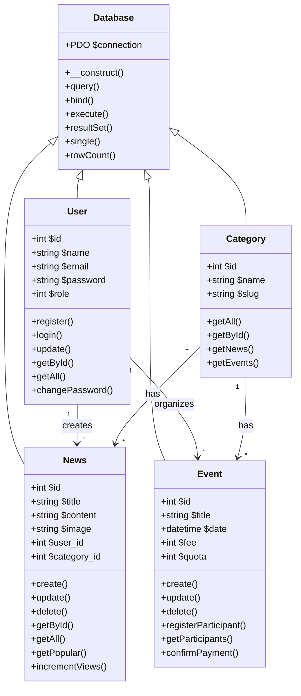

# BAB 3.4.2 DIAGRAM KELAS

---

## 9.1 Struktur Kelas Sistem

---

## 9.2 Kelas Utama dan Tanggung Jawab

| Kelas | Tanggung Jawab | Jumlah Metode |
|---|---|---|
| `Database` | Koneksi dan operasi database umum | 7 |
| `User` | Manajemen pengguna, otentikasi | 8 |
| `News` | Manajemen konten berita | 9 |
| `Event` | Manajemen event dan peserta | 10 |
| `Category` | Manajemen kategori sistem | 5 |

✅ Semua kelas menggunakan prinsip inheritance dari kelas Database

---

## 9.3 Visibilitas Atribut dan Metode

✅ Semua atribut dideklarasikan sebagai `private`  
✅ Semua metode akses dideklarasikan sebagai `public`  
✅ Tidak ada atribut publik yang dapat diakses langsung  
✅ Semua operasi data melalui method getter dan setter

---

## 9.4 Relasi Antar Kelas

| Relasi | Kardinalitas |
|---|---|
| User → News | 1 to Many |
| User → Event | 1 to Many |
| Category → News | 1 to Many |
| Category → Event | 1 to Many |
| Event → User | Many to Many |

---

## 9.5 Prinsip OOP yang Diterapkan

✅ ✅ Encapsulation: Semua atribut private  
✅ ✅ Inheritance: Semua kelas turunan dari Database  
✅ ✅ Polymorphism: Metode dengan nama sama perilaku berbeda  
✅ ✅ Abstraction: Detail implementasi tersembunyi  
✅ ✅ Single Responsibility: Setiap kelas hanya satu tanggung jawab