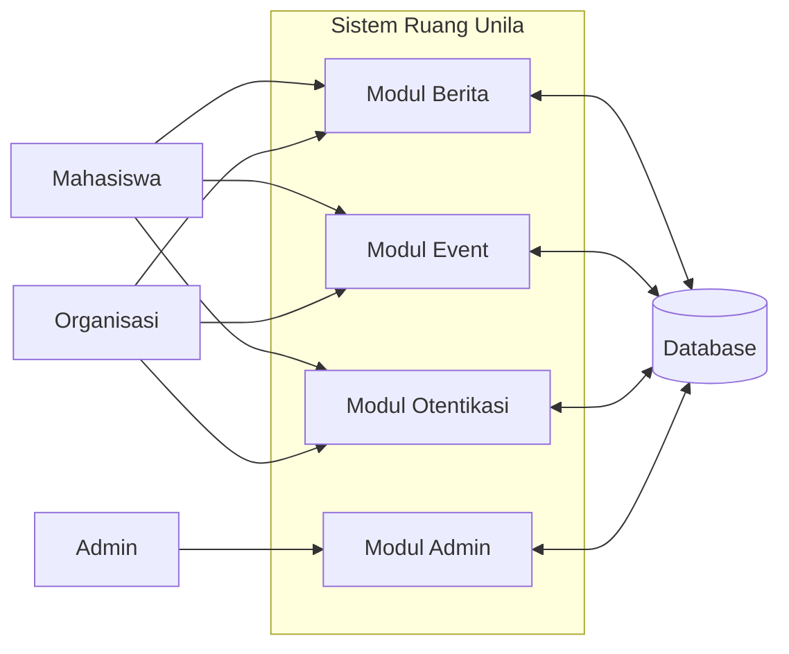

# BAB 3.4.4 DIAGRAM DATA FLOW (DFD)

---

## 11.1 Context Diagram (Level 0)

```
┌─────────────────────────────────────────────────┐
│                                                 │
│              SISTEM RUANG UNILA                 │
│                                                 │
└─────────┬───────────────────┬───────────────────┘
          │                   │
          │                   │
Mahasiswa ◄───────────────────► Organisasi
          │                   │
          │                   │
          ▼                   ▼
        Admin             Database
```

✅ Seluruh entitas eksternal yang berinteraksi dengan sistem

---

## 11.2 DFD Level 1



---

## 11.3 Penjelasan Proses

| Kode | Nama Proses | Input | Output |
|---|---|---|---|
| P1 | Modul Berita | Request berita, pencarian | Daftar berita, detail berita |
| P2 | Modul Event | Request event, pendaftaran | Daftar event, status pendaftaran |
| P3 | Modul Otentikasi | Email, password | Session user, token akses |
| P4 | Modul Admin | Perintah admin | Laporan, statistik, pengaturan |

---

## 11.4 Aliran Data Utama

```
Mahasiswa → Request Halaman → Modul Berita → Query Database → Hasil → Tampilan User
```

✅ Semua aliran data melalui proses validasi sebelum menyentuh database

---

## 11.5 Aturan DFD
✅ ✅ Tidak ada aliran data langsung antar eksternal entity  
✅ ✅ Setiap proses memiliki input dan output  
✅ ✅ Semua data tersimpan di database terpusat  
✅ ✅ Tidak ada proses yang tidak terhubung dengan data store  
✅ ✅ Setiap aliran data memiliki label yang jelas

---

## 11.6 Level Dekomposisi
- Level 0: Context Diagram (seluruh sistem)
- Level 1: 4 modul utama
- Level 2: Detail setiap modul
- Level 3: Proses individual

✅ Sistem didekomposisi sampai level proses tunggal