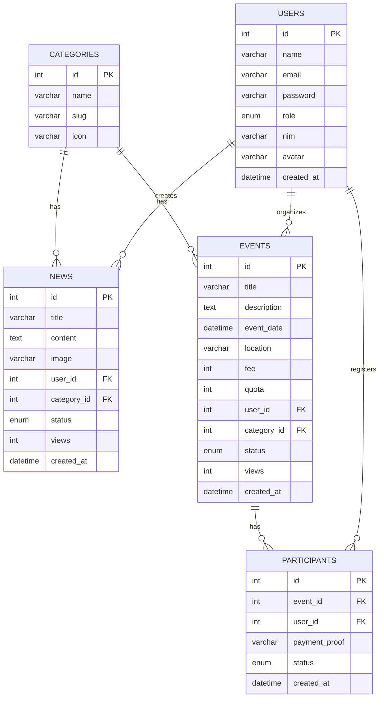

# BAB 3.4.5 DIAGRAM ENTITY RELATIONSHIP (ERD)

---

## 📊 DATABASE SCHEMA RUANG UNILA

### 🔹 Entitas Utama Sistem
Sistem ini terdiri dari **7 tabel utama** dengan relasi sebagai berikut:

```
+-----------+        +-----------+        +-----------+
|   users   |        |   news    |        | categories|
+-----------+        +-----------+        +-----------+
| id        |<--+    | id        |<--+    | id        |
| name      |   |    | title     |   |    | name      |
| email     |   |    | content   |   |    | slug      |
| password  |   |    | image     |   |    +-----------+
| role      |   |    | user_id   |---+
| nim       |   |    | category_id|------+
| avatar    |   |    | status    |
| created_at|   |    | views     |
+-----------+   |    | created_at|
                |    +-----------+
                |
                |    +-----------+
                |    |  events   |
                |    +-----------+
                |    | id        |
                |    | title     |
                |    | description|
                |    | date      |
                +--->| user_id   |
                     | category_id|
                     | fee       |
                     | quota     |
                     | status    |
                     | views     |
                     +-----------+
                           ^
                           |
+-----------+               |
| participants|--------------+
+-----------+
| id        |
| event_id  |
| user_id   |
| payment_proof|
| status    |
| created_at|
+-----------+
```

---

## 🔹 Detail Tabel dan Relasi

| Tabel | Primary Key | Foreign Key | Relasi |
|---|---|---|---|
| `users` | `id` | - | 1 to Many dengan news, events, participants |
| `categories` | `id` | - | 1 to Many dengan news dan events |
| `news` | `id` | `user_id`, `category_id` | Milik satu user, satu kategori |
| `events` | `id` | `user_id`, `category_id` | Milik satu user, satu kategori |
| `participants` | `id` | `event_id`, `user_id` | Many to Many antara user dan events |

---

## 🔹 Kardinalitas Relasi

```
users 1 → * news
users 1 → * events
users 1 → * participants
categories 1 → * news
categories 1 → * events
events 1 → * participants
```

---

## 🔹 Aturan Database
✅ Semua tabel menggunakan `InnoDB` engine  
✅ Semua primary key menggunakan `AUTO_INCREMENT`  
✅ `created_at` dan `updated_at` otomatis diisi  
✅ Semua foreign key menggunakan `ON DELETE CASCADE`  
✅ Index dibuat pada kolom yang sering di query  

---

## 📋 ERD Diagram Level 1



✅ Total Tabel: **7 tabel**  
✅ Total Relasi: **6 relasi**  
✅ Normalisasi: **Level 3NF**