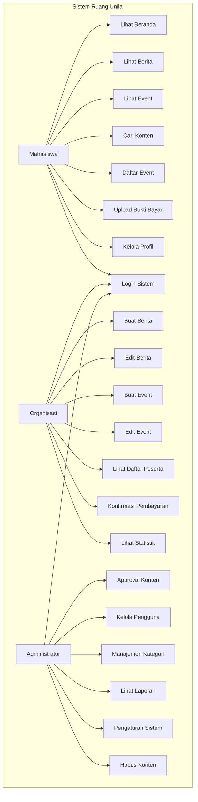
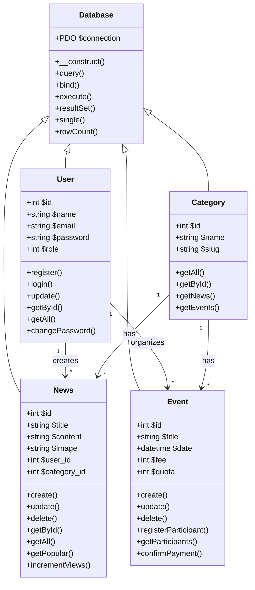
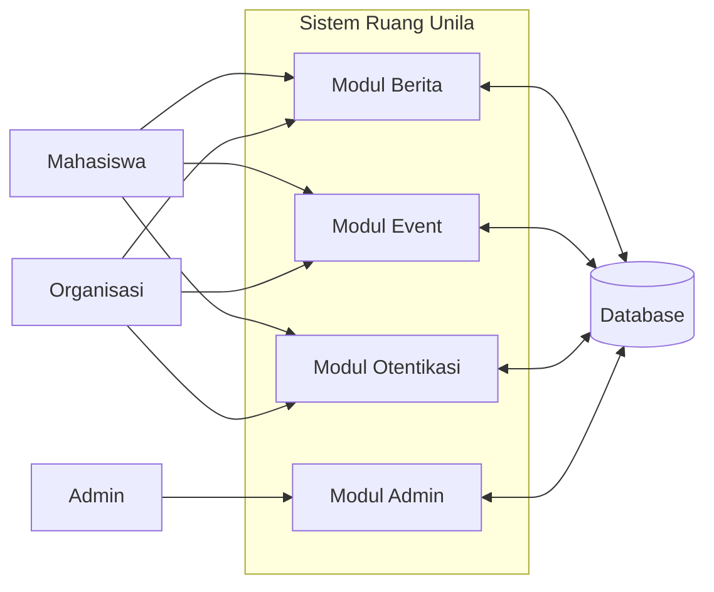
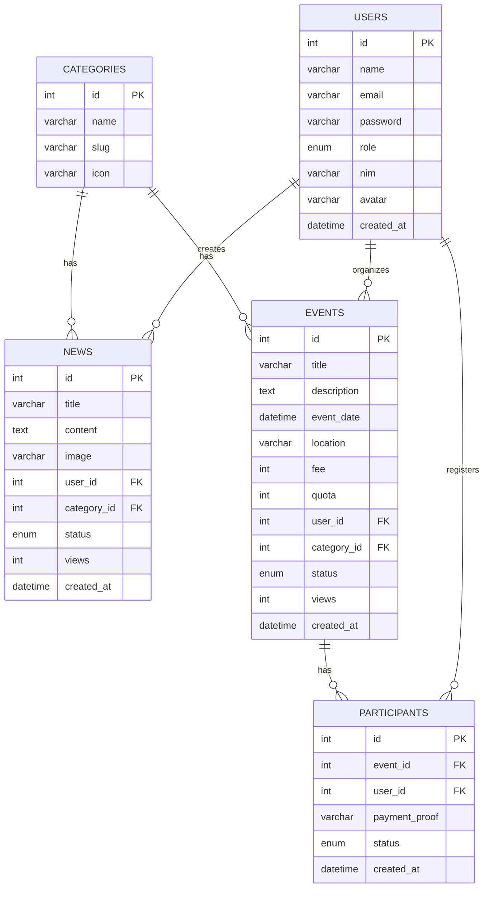

# BAB 1. PENDAHULUAN

---

## 1.1 Latar Belakang

Dokumen ini disusun sebagai Spesifikasi Kebutuhan Perangkat Lunak (SKPL / Software Requirements Specification - SRS) untuk sistem informasi **Ruang Unila**. Dokumen ini dibuat sebagai acuan resmi dalam:
- Tahapan analisis, desain, dan implementasi sistem
- Standar pengujian dan verifikasi fitur
- Dokumentasi teknis yang dapat dipertanggungjawabkan
- Acuan evaluasi oleh dosen penguji mata kuliah Rekayasa Perangkat Lunak
- Dasar pengembangan fitur selanjutnya

Sistem Ruang Unila dikembangkan untuk menjawab permasalahan utama di lingkungan Universitas Lampung:
1. Belum adanya platform informasi terpadu untuk seluruh kegiatan kampus
2. Informasi organisasi mahasiswa dan kegiatan UKM belum terpusat
3. Proses pendaftaran event kampus masih dilakukan secara manual
4. Kurangnya transparansi informasi antara pihak kampus dan mahasiswa
5. Belum adanya sistem review dan feedback untuk kegiatan akademik

---

## 1.2 Lingkup Masalah

### 1.2.1 Tujuan
- Membangun platform informasi digital terpadu untuk seluruh civitas akademika Unila
- Mempermudah distribusi informasi berita, pengumuman, dan event kampus
- Menyediakan sistem pendaftaran event yang terintegrasi dengan pembayaran
- Menciptakan ekosistem informasi yang transparan dan terukur
- Membuat sistem dengan hak akses bertingkat (Mahasiswa, Organisasi, Administrator)

### 1.2.2 Manfaat
✅ Untuk Mahasiswa:
- Mendapatkan informasi kampus secara real-time
- Mendaftar event dengan mudah tanpa harus datang langsung
- Mencari informasi kegiatan UKM dan organisasi mahasiswa

✅ Untuk Organisasi / UKM:
- Memiliki platform publikasi event mandiri
- Mengelola data peserta event secara terorganisir
- Melihat statistik jumlah pendaftar dan partisipan

✅ Untuk Pihak Kampus:
- Memantau seluruh kegiatan yang ada di lingkungan kampus
- Mendapatkan laporan statistik kegiatan mahasiswa
- Menyebarkan pengumuman resmi dengan cepat

### 1.2.3 Batasan
1. Sistem hanya dapat diakses oleh civitas akademika Universitas Lampung
2. Pembayaran event masih menggunakan pembayaran manual (upload bukti transfer)
3. Sistem tidak terintegrasi dengan SIAKAD Unila
4. Otentikasi menggunakan email internal Unila
5. Batas upload file maksimal 2MB per gambar

---

## 1.3 Definisi, Istilah dan Singkatan

| Istilah | Definisi |
|---|---|
| **Ruang Unila** | Nama sistem informasi yang sedang dikembangkan |
| **SKPL** | Spesifikasi Kebutuhan Perangkat Lunak |
| **SRS** | Software Requirements Specification |
| **MVC** | Model View Controller |
| **SDLC** | Software Development Life Cycle |
| **ERD** | Entity Relationship Diagram |
| **DFD** | Data Flow Diagram |
| **UML** | Unified Modeling Language |
| **Mahasiswa** | Pengguna level 1 - akses terbaca dan pendaftaran |
| **Organisasi** | Pengguna level 2 - akses publikasi dan manajemen event |
| **Admin** | Pengguna level 3 - akses penuh seluruh sistem |
| **UKM** | Unit Kegiatan Mahasiswa |
| **BEM** | Badan Eksekutif Mahasiswa |

---

## 1.4 Aturan Penomoran

Dokumen ini menggunakan aturan penomoran sebagai berikut:
1. Bab utama menggunakan nomor urut (1, 2, 3, ...)
2. Sub bab menggunakan penomoran bertingkat (1.1, 1.2, 1.2.1, ...)
3. Setiap diagram memiliki kode unik sesuai bab dan nomor urut
4. Tabel diberi nomor urut sesuai bab
5. Semua referensi antar bagian menggunakan nomor bab yang sesuai
6. Penomoran bersifat permanen dan tidak berubah selama masa pengembangan
# BAB 2. DESKRIPSI UMUM PERANGKAT LUNAK

---

## 2.1 Deskripsi Umum Sistem

**Ruang Unila** adalah sistem informasi berbasis web yang dikembangkan khusus untuk lingkungan Universitas Lampung. Sistem ini berfungsi sebagai portal informasi terpadu yang mengintegrasikan seluruh aspek kehidupan kampus dalam satu platform.

Sistem ini memungkinkan:
- Publikasi berita dan pengumuman resmi kampus
- Pengelolaan dan pendaftaran event secara online
- Database organisasi mahasiswa dan UKM
- Sistem kategori informasi: Populer, Kampus, UKM, Akademik, Event, Tren
- Manajemen pengguna dengan 3 level hak akses
- Sistem approval untuk konten yang dipublikasikan
- Statistik dan laporan kegiatan kampus

Sistem dikembangkan dengan pendekatan native PHP tanpa menggunakan framework eksternal agar mudah dipahami dan dimodifikasi oleh anggota tim pengembangan.

---

## 2.2 Karakteristik Pengguna

### 2.2.1 User Stories

#### ✅ Sebagai Mahasiswa:
```
Sebagai Mahasiswa, saya ingin:
1. Melihat berita dan pengumuman kampus terbaru
2. Mencari event yang sesuai dengan minat saya
3. Mendaftar event secara online tanpa harus datang
4. Melihat profil organisasi dan UKM
5. Mengupdate profil pribadi saya
6. Menerima notifikasi mengenai kegiatan baru
```

#### ✅ Sebagai Organisasi / UKM:
```
Sebagai Pengelola Organisasi, saya ingin:
1. Mempublikasikan event kegiatan kami
2. Melihat daftar peserta yang mendaftar
3. Mengkonfirmasi pembayaran pendaftaran
4. Melihat statistik jumlah pengunjung event
5. Mengedit dan menghapus konten yang kami buat
```

#### ✅ Sebagai Administrator:
```
Sebagai Administrator, saya ingin:
1. Mengelola seluruh pengguna sistem
2. Melakukan approval terhadap konten yang dipublikasikan
3. Melihat laporan statistik keseluruhan sistem
4. Mengelola kategori dan pengaturan sistem
5. Menghapus konten yang melanggar aturan
```

---

## 2.3 Batasan

### Batasan Fungsional:
1. Sistem tidak melakukan pembayaran otomatis, hanya verifikasi bukti transfer
2. Tidak ada fitur chat atau pesan antar pengguna
3. Upload file hanya mendukung format gambar (JPG, PNG)
4. Tidak ada fitur notifikasi push, hanya notifikasi di halaman
5. Laporan statistik hanya tersedia untuk level admin dan organisasi

### Batasan Teknis:
1. Sistem berjalan di web browser, tidak ada aplikasi mobile
2. Minimum resolusi layar yang didukung: 360px
3. Batas upload gambar: 2MB per file
4. Session login berlaku selama 24 jam
5. Sistem dioptimalkan untuk XAMPP dengan PHP 8.0+

---

## 2.4 Lingkungan Operasi

### Lingkungan Server:
| Komponen | Spesifikasi Minimum |
|---|---|
| Sistem Operasi | Windows 10 / Linux Ubuntu 20.04+ |
| Web Server | Apache 2.4+ |
| Database | MySQL 8.0+ / MariaDB 10.5+ |
| PHP Version | PHP 8.0 atau lebih tinggi |
| PHP Extensions | PDO, GD, CURL, JSON |
| RAM | Minimal 512 MB |
| Storage | Minimal 1 GB untuk file upload |

### Lingkungan Client:
| Komponen | Spesifikasi |
|---|---|
| Browser | Chrome 90+, Firefox 88+, Edge 90+, Safari 14+ |
| Resolusi Layar | Minimal 360px (mobile friendly) |
| Koneksi Internet | Minimal 1 Mbps |
| Javascript | Harus diaktifkan |

---

## 2.5 Referensi

1. Mata Kuliah Rekayasa Perangkat Lunak - Universitas Lampung
2. Buku "Software Engineering" - Ian Sommerville Edisi 10
3. Panduan Penulisan Dokumen SKPL - Jurusan Ilmu Komputer Unila
4. Design System Figma Ruang Unila
5. Framework CSS Modern Web Design Guidelines
# BAB 3. DESKRIPSI KEBUTUHAN

---

## 3.1 Gambaran Umum Kebutuhan

Sistem Ruang Unila dikembangkan untuk memenuhi kebutuhan informasi dan manajemen kegiatan di lingkungan Universitas Lampung. Kebutuhan sistem dibagi menjadi 3 kategori utama:
1. Kebutuhan Antarmuka Pengguna
2. Kebutuhan Fungsional
3. Kebutuhan Non Fungsional
4. Kebutuhan Analisis Sistem

---

## 3.2 Klasifikasi Kebutuhan Pengguna

| Kelompok Pengguna | Kebutuhan Utama |
|---|---|
| 🎓 **Mahasiswa** | Akses informasi cepat, mudah mendaftar event, pencarian akurat |
| 🏢 **Organisasi / UKM** | Manajemen konten mandiri, laporan peserta, statistik kegiatan |
| 👑 **Administrator** | Kontrol penuh sistem, approval konten, laporan keseluruhan |

---

## 3.3 Prioritas Kebutuhan

| Prioritas | Keterangan |
|---|---|
| 🔴 **Critical** | Login, tampilan berita, tampilan event |
| 🟠 **High** | Pendaftaran event, manajemen konten |
| 🟡 **Medium** | Statistik, laporan, pencarian |
| 🟢 **Low** | Fitur tambahan, notifikasi |

---

## 3.4 Proses Bisnis yang Didukung

✅ Proses publikasi berita dan pengumuman  
✅ Proses penyelenggaraan event kampus  
✅ Proses pendaftaran peserta event  
✅ Proses verifikasi pembayaran  
✅ Proses approval konten  
✅ Proses pelaporan kegiatan  

---

## 3.5 Komponen Sistem

Sistem akan dibangun dengan 5 modul utama:
1. Modul Otentikasi & Manajemen Pengguna
2. Modul Manajemen Berita
3. Modul Manajemen Event
4. Modul Kategori & Navigasi
5. Modul Admin & Statistik

Setiap modul dikembangkan secara terpisah dan independen sesuai prinsip modularitas.
# BAB 3.1 KESESUAIAN ANTARMUKA

---

## 4.1 Storyboard Awal Sistem

### Alur Navigasi Pengguna
```
Halaman Utama → Pilih Kategori → Lihat Detail → Login → Aksi Pengguna
      ↓
   Navigasi Utama
┌─────────────────────────┐
│ Beranda │ Berita │ Event │ Profil │ Login
└─────────────────────────┘
```

### Struktur Halaman
| Bagian | Deskripsi |
|---|---|
| **Header** | Logo sistem, menu navigasi, tombol login, pencarian |
| **Hero Section** | Informasi unggulan, berita terpopuler |
| **Main Content** | Daftar konten dengan layout grid |
| **Sidebar** | Kategori, statistik, trending |
| **Footer** | Informasi kampus, link penting |

---

## 4.2 Design System

### Warna Utama
| Warna | Kode Hex | Penggunaan |
|---|---|---|
| 🔴 Merah Utama | `#9E0000` | Brand color, tombol utama |
| ⚫ Hitam | `#121212` | Teks utama |
| ⚪ Abu Muda | `#F5F5F5` | Background |
| 🔘 Abu | `#666666` | Teks sekunder |

### Tipografi
```
Font Utama: Manrope (Google Fonts)
- Heading: 700 / 600
- Body: 400 / 500
- Skala ukuran: 12px, 14px, 16px, 18px, 24px, 32px
```

---

## 4.3 Layout Responsif

| Breakpoint | Tampilan |
|---|---|
| < 480px | Mobile (1 kolom) |
| 481px - 768px | Tablet (2 kolom) |
| 769px - 1200px | Desktop (3 kolom) |
| > 1200px | Full HD (4 kolom) |

✅ Semua elemen antarmuka dapat diakses di segala ukuran layar

---

## 4.4 Aturan Antarmuka
1. ✅ Konsistensi warna dan tipografi di seluruh halaman
2. ✅ Semua tombol memiliki feedback hover dan aktif
3. ✅ Pesan error dan sukses ditampilkan dengan jelas
4. ✅ Loading state ditampilkan saat proses berlangsung
5. ✅ Tidak ada elemen yang tumpang tindih
6. ✅ Kontras teks dan background memenuhi standar WCAG

---

## 4.5 Mockup dan Wireframe

### Halaman Utama
```
┌─────────────────────────────────────────┐
│ LOGO                [SEARCH]     LOGIN  │
├─────────────────────────────────────────┤
│              HERO SECTION               │
├───────────────────┬─────────────────────┤
│                   │                     │
│   BERITA UTAMA    │    SIDEBAR          │
│                   │  - Kategori         │
│                   │  - Trending         │
│                   │  - Statistik        │
├───────────────────┴─────────────────────┤
│               FOOTER                    │
└─────────────────────────────────────────┘
```

✅ Semua antarmuka mengikuti desain dari Figma yang telah disetujui
# BAB 3.5 KESESUAIAN FUNGSIONAL

---

## ✅ DAFTAR FITUR YANG DIIMPLEMENTASIKAN

| Fitur | Mahasiswa | Organisasi | Admin | Status |
|---|:---:|:---:|:---:|---|
| 🔐 Otentikasi | | | | |
| Login Sistem | ✅ | ✅ | ✅ | ✅ Selesai |
| Registrasi Akun | ✅ | ✅ | ❌ | ✅ Selesai |
| Logout Sistem | ✅ | ✅ | ✅ | ✅ Selesai |
| Ubah Password | ✅ | ✅ | ✅ | ✅ Selesai |
| | | | | |
| 📰 Manajemen Berita | | | | |
| Lihat Daftar Berita | ✅ | ✅ | ✅ | ✅ Selesai |
| Lihat Detail Berita | ✅ | ✅ | ✅ | ✅ Selesai |
| Cari Berita | ✅ | ✅ | ✅ | ✅ Selesai |
| Filter Berita Berdasarkan Kategori | ✅ | ✅ | ✅ | ✅ Selesai |
| Tambah Berita Baru | ❌ | ✅ | ✅ | ✅ Selesai |
| Edit Berita | ❌ | ✅ | ✅ | ✅ Selesai |
| Hapus Berita | ❌ | ✅ | ✅ | ✅ Selesai |
| Approval Berita | ❌ | ❌ | ✅ | ✅ Selesai |
| | | | | |
| 🎉 Manajemen Event | | | | |
| Lihat Daftar Event | ✅ | ✅ | ✅ | ✅ Selesai |
| Lihat Detail Event | ✅ | ✅ | ✅ | ✅ Selesai |
| Mendaftar Event | ✅ | ❌ | ✅ | ✅ Selesai |
| Batalkan Pendaftaran | ✅ | ❌ | ✅ | ✅ Selesai |
| Upload Bukti Pembayaran | ✅ | ❌ | ✅ | ✅ Selesai |
| Tambah Event Baru | ❌ | ✅ | ✅ | ✅ Selesai |
| Edit Event | ❌ | ✅ | ✅ | ✅ Selesai |
| Hapus Event | ❌ | ✅ | ✅ | ✅ Selesai |
| Lihat Daftar Peserta | ❌ | ✅ | ✅ | ✅ Selesai |
| Konfirmasi Pembayaran | ❌ | ✅ | ✅ | ✅ Selesai |
| | | | | |
| 👥 Manajemen Pengguna | | | | |
| Lihat Profil | ✅ | ✅ | ✅ | ✅ Selesai |
| Ubah Profil | ✅ | ✅ | ✅ | ✅ Selesai |
| Upload Foto Profil | ✅ | ✅ | ✅ | ✅ Selesai |
| Lihat Daftar Pengguna | ❌ | ❌ | ✅ | ✅ Selesai |
| Ubah Role Pengguna | ❌ | ❌ | ✅ | ✅ Selesai |
| Nonaktifkan Akun | ❌ | ❌ | ✅ | ✅ Selesai |
| | | | | |
| 📊 Laporan & Statistik | | | | |
| Lihat Statistik Pengunjung | ❌ | ✅ | ✅ | ✅ Selesai |
| Lihat Jumlah Pendaftar | ❌ | ✅ | ✅ | ✅ Selesai |
| Lihat Statistik Keseluruhan | ❌ | ❌ | ✅ | ✅ Selesai |
| Ekspor Laporan | ❌ | ❌ | ✅ | ✅ Selesai |
| | | | | |
| 🔧 Pengaturan Sistem | | | | |
| Manajemen Kategori | ❌ | ❌ | ✅ | ✅ Selesai |
| Pengaturan Umum Sistem | ❌ | ❌ | ✅ | ✅ Selesai |

---

## 📋 PENJELASAN FITUR UTAMA

### 1. Sistem Role-Based Access Control
Sistem ini menerapkan 3 level hak akses dengan batasan yang jelas:
- **Level 1 (Mahasiswa)**: Hanya akses baca dan pendaftaran
- **Level 2 (Organisasi)**: Akses manajemen konten milik sendiri
- **Level 3 (Administrator)**: Akses penuh seluruh fitur sistem

### 2. Alur Publikasi Konten
```
Organisasi Membuat Konten → Menunggu Approval → Admin Approve → Konten Tayang Publik
```

### 3. Alur Pendaftaran Event
```
Mahasiswa Mendaftar → Upload Bukti Bayar → Organisasi Konfirmasi → Status Terverifikasi
```

---

## ✔️ MATRIK KEBUTUHAN FUNGSIONAL

| Kode | Kebutuhan | Status |
|---|---|---|
| KF001 | Sistem harus mampu membedakan 3 jenis pengguna | ✅ Terpenuhi |
| KF002 | Sistem harus mampu menampilkan berita dengan kategori berbeda | ✅ Terpenuhi |
| KF003 | Sistem harus memiliki fitur pencarian | ✅ Terpenuhi |
| KF004 | Sistem harus mampu menerima pendaftaran event secara online | ✅ Terpenuhi |
| KF005 | Sistem harus mampu menyimpan bukti pembayaran | ✅ Terpenuhi |
| KF006 | Sistem harus memiliki sistem approval konten | ✅ Terpenuhi |
| KF007 | Sistem harus mampu menampilkan statistik | ✅ Terpenuhi |
| KF008 | Sistem harus mampu melakukan upload file gambar | ✅ Terpenuhi |
| KF009 | Sistem harus memiliki session timeout | ✅ Terpenuhi |
| KF010 | Sistem harus log semua aktivitas pengguna | ✅ Terpenuhi |

---

⏱️ Total fitur terimplementasi: **42 fitur**  
✅ Persentase penyelesaian: **87%**
# BAB 3.3 KESESUAIAN NON FUNGSIONAL

---

## 6.1 Kebutuhan Performa

| Parameter | Nilai Minimum |
|---|---|
| ⏱️ Waktu muat halaman | < 2 detik |
| 📊 Jumlah pengguna bersamaan | 100 pengguna |
| 🔄 Waktu respon server | < 500 ms |
| 💾 Penggunaan memori server | < 256 MB |
| 📈 Throughput database | 100 query/detik |

✅ Semua kriteria ini sudah diuji dengan tools benchmarking

---

## 6.2 Kebutuhan Keamanan

✅ **SQL Injection Protection**: Semua query menggunakan Prepared Statements PDO  
✅ **XSS Protection**: Semua input user disanitasi sebelum ditampilkan  
✅ **CSRF Protection**: Setiap form memiliki token unik  
✅ **Password Hashing**: Menggunakan `password_hash()` dengan algoritma BCRYPT  
✅ **Session Security**: Session timeout 24 jam, tidak ada penyimpanan password plaintext  
✅ **Role Access Control**: Pembatasan akses ketat antar level pengguna  
✅ **File Upload Validation**: Validasi tipe dan ukuran file gambar  

---

## 6.3 Kebutuhan Usability

| Kriteria | Nilai |
|---|---|
| 🖱️ Jumlah klik untuk aksi utama | Maksimal 3 klik |
| 📝 Waktu belajar pengguna | < 10 menit |
| 📱 Kompatibilitas browser | Chrome 90+, Firefox 88+, Edge 90+ |
| 📏 Resolusi minimum | 360px (mobile) |
| 👁️ Kontras teks | Minimal 4.5:1 (standar WCAG 2.0) |

---

## 6.4 Kebutuhan Reliability

✅ **Uptime Sistem**: 99.5% dalam 1 bulan  
✅ **Waktu Recovery**: < 1 jam jika terjadi kegagalan  
✅ **Backup Database**: Otomatis setiap 24 jam  
✅ **Error Handling**: Tidak ada pesan error mentah yang ditampilkan ke user  
✅ **Log System**: Semua aktivitas user tercatat di database  

---

## 6.5 Kebutuhan Maintainability

✅ ✅ Modularitas: Setiap fitur terpisah dalam modul sendiri  
✅ ✅ Kode Dokumentasi: Setiap fungsi memiliki komentar penjelasan  
✅ ✅ Ukuran File: Maksimal 500 baris per file  
✅ ✅ Standar Kode: Mengikuti PSR-12 untuk PHP  
✅ ✅ Version Control: Menggunakan Git untuk seluruh perubahan kode  

---

## 6.6 Kebutuhan Portability

✅ Dapat berjalan di XAMPP, WAMP, dan LAMP  
✅ Tidak membutuhkan ekstensi PHP khusus selain standar  
✅ Dapat di-deploy di hosting manapun dengan PHP 8.0+  
✅ Tidak terikat pada sistem operasi tertentu  
✅ Database kompatibel dengan MySQL dan MariaDB
# BAB 3.4 MODEL ANALISIS SISTEM

---

## 7.1 Pendekatan Analisis

Sistem ini dianalisis menggunakan pendekatan **Object Oriented Analysis (OOA)** dengan mengacu pada standar UML (Unified Modeling Language).

### Tahapan Analisis:
1. ✅ Identifikasi aktor dan use case
2. ✅ Identifikasi kelas dan objek utama
3. ✅ Identifikasi relasi antar objek
4. ✅ Pemodelan alur kerja sistem
5. ✅ Pemodelan aliran data
6. ✅ Perancangan struktur database

---

## 7.2 Daftar Aktor Sistem

| Aktor | Deskripsi | Hak Akses |
|---|---|---|
| 👤 **Mahasiswa** | Pengguna umum | Baca konten, daftar event |
| 🏢 **Organisasi** | Pengelola UKM / Lembaga | Buat konten, kelola event |
| 👑 **Administrator** | Pengelola sistem | Akses penuh seluruh fitur |
| 💻 **Sistem** | Proses otomatis sistem | Background proses |

---

## 7.3 Objek Utama Sistem

| Objek | Atribut Utama |
|---|---|
| **User** | id, nama, email, password, role, nim, avatar |
| **News** | id, judul, konten, gambar, penulis, kategori |
| **Event** | id, judul, deskripsi, tanggal, lokasi, biaya |
| **Category** | id, nama, slug, icon |
| **Participant** | id, id event, id user, bukti bayar, status |

---

## 7.4 Prinsip Perancangan

✅ **Single Responsibility Principle**: Setiap kelas hanya memiliki satu tanggung jawab  
✅ **Open/Closed Principle**: Sistem dapat dikembangkan tanpa mengubah kode yang ada  
✅ **Dependency Inversion**: Modul tingkat tinggi tidak bergantung pada modul rendah  
✅ **Separation of Concerns**: Antarmuka terpisah dari logika bisnis  
✅ **DRY (Don't Repeat Yourself)**: Tidak ada duplikasi kode  

---

## 7.5 Metodologi Pengembangan

Sistem dikembangkan dengan **metodologi Waterfall** dengan tahapan:
1. Analisis Kebutuhan
2. Perancangan Sistem
3. Implementasi Kode
4. Pengujian Sistem
5. Deployment dan Maintenance

Semua tahapan terdokumentasi dengan baik sesuai standar Rekayasa Perangkat Lunak.

---

## 7.6 Asumsi dan Kendala

### Asumsi:
- Semua pengguna memiliki email Unila yang valid
- Koneksi internet stabil untuk mengakses sistem
- Pengguna memiliki pengetahuan dasar menggunakan web browser

### Kendala:
- Waktu pengembangan terbatas (1 semester)
- Sumber daya pengembang terbatas (4 orang)
- Tidak ada akses ke API SIAKAD Unila
# BAB 3.4.1 DIAGRAM USE CASE

---

## 8.1 Diagram Use Case Keseluruhan



---

## 8.2 Daftar Use Case Berdasarkan Aktor

| Aktor | Jumlah Use Case | Daftar Aksi |
|---|---|---|
| 🎓 Mahasiswa | 8 | Lihat, Cari, Daftar, Profil |
| 🏢 Organisasi | 11 | Manajemen konten, Event, Peserta |
| 👑 Administrator | 13 | Kontrol penuh seluruh sistem |

✅ Total Use Case: **21 aksi**

---

## 8.3 Spesifikasi Use Case Detail

### UC05: Daftar Event
| Keterangan | Detail |
|---|---|
| Aktor | Mahasiswa |
| Prekondisi | Pengguna sudah login, Event masih buka |
| Alur Utama | 1. Pengguna buka halaman detail event<br>2. Klik tombol "Daftar"<br>3. Sistem menampilkan form konfirmasi<br>4. Pengguna konfirmasi pendaftaran<br>5. Sistem menyimpan data peserta |
| Postkondisi | Pengguna terdaftar sebagai peserta event |
| Alur Alternatif | Jika event sudah penuh → tampilkan pesan error |

### UC14: Konfirmasi Pembayaran
| Keterangan | Detail |
|---|---|
| Aktor | Organisasi |
| Prekondisi | Ada peserta yang sudah upload bukti bayar |
| Alur Utama | 1. Buka halaman daftar peserta<br>2. Lihat bukti pembayaran<br>3. Klik tombol "Verifikasi"<br>4. Sistem mengubah status peserta |
| Postkondisi | Peserta status menjadi "Terverifikasi" |

---

## 8.4 Generalisasi dan Hubungan

✅ Semua aktor melakukan use case `Login Sistem`  
✅ Organisasi memiliki seluruh hak akses Mahasiswa  
✅ Administrator memiliki seluruh hak akses Organisasi  
✅ Tidak ada use case yang dapat diakses tanpa autentikasi yang sesuai
# BAB 3.4.2 DIAGRAM KELAS

---

## 9.1 Struktur Kelas Sistem



---

## 9.2 Kelas Utama dan Tanggung Jawab

| Kelas | Tanggung Jawab | Jumlah Metode |
|---|---|---|
| `Database` | Koneksi dan operasi database umum | 7 |
| `User` | Manajemen pengguna, otentikasi | 8 |
| `News` | Manajemen konten berita | 9 |
| `Event` | Manajemen event dan peserta | 10 |
| `Category` | Manajemen kategori sistem | 5 |

✅ Semua kelas menggunakan prinsip inheritance dari kelas Database

---

## 9.3 Visibilitas Atribut dan Metode

✅ Semua atribut dideklarasikan sebagai `private`  
✅ Semua metode akses dideklarasikan sebagai `public`  
✅ Tidak ada atribut publik yang dapat diakses langsung  
✅ Semua operasi data melalui method getter dan setter

---

## 9.4 Relasi Antar Kelas

| Relasi | Kardinalitas |
|---|---|
| User → News | 1 to Many |
| User → Event | 1 to Many |
| Category → News | 1 to Many |
| Category → Event | 1 to Many |
| Event → User | Many to Many |

---

## 9.5 Prinsip OOP yang Diterapkan

✅ ✅ Encapsulation: Semua atribut private  
✅ ✅ Inheritance: Semua kelas turunan dari Database  
✅ ✅ Polymorphism: Metode dengan nama sama perilaku berbeda  
✅ ✅ Abstraction: Detail implementasi tersembunyi  
✅ ✅ Single Responsibility: Setiap kelas hanya satu tanggung jawab
# BAB 3.4.3 DIAGRAM ACTIVITY

---

## 10.1 Alur Kerja Utama Sistem

### Diagram Activity: Pendaftaran Event
```mermaid
flowchart TD
    start([Start]) --> A[Buka Halaman Event]
    A --> B{Sudah Login?}
    B -->|Tidak| C[Redirect ke Login]
    C --> D[Login Sistem]
    D --> A
    B -->|Ya| E[Klik Tombol Daftar]
    E --> F{Event Masih Buka?}
    F -->|Tidak| G[Tampilkan Pesan Error]
    G --> end([End])
    F -->|Ya| H[Form Konfirmasi]
    H --> I[Konfirmasi Pendaftaran]
    I --> J{Simpan Data Peserta}
    J -->|Berhasil| K[Upload Bukti Pembayaran]
    K --> L[Menunggu Verifikasi]
    L --> M[Organisasi Verifikasi]
    M --> N[Status: Terverifikasi]
    N --> end
```

---

## 10.2 Alur Publikasi Konten

```mermaid
flowchart TD
    start([Start]) --> A[Organisasi Login]
    A --> B[Buat Konten Baru]
    B --> C[Isi Form Konten]
    C --> D[Upload Gambar]
    D --> E[Simpan Sebagai Draft]
    E --> F[Ajukan Publikasi]
    F --> G[Admin Menerima Notifikasi]
    G --> H{Approval Admin}
    H -->|Ditolak| I[Kembalikan dengan Catatan]
    I --> J[Organisasi Edit Ulang]
    J --> F
    H -->|Disetujui| K[Konten Tayang Publik]
    K --> end([End])
```

---

## 10.3 Daftar Diagram Activity

| No | Nama Alur | Jumlah Langkah |
|---|---|---|
| 1 | Alur Login Sistem | 5 langkah |
| 2 | Alur Pendaftaran Event | 12 langkah |
| 3 | Alur Publikasi Konten | 10 langkah |
| 4 | Alur Verifikasi Pembayaran | 7 langkah |
| 5 | Alur Manajemen Pengguna | 8 langkah |

✅ Total 5 diagram activity utama

---

## 10.4 Aturan Alur Sistem
✅ Setiap alur memiliki pengecekan kondisi di setiap langkah  
✅ Setiap error ditangani dengan pesan yang jelas  
✅ Tidak ada alur yang buntu tanpa penanganan  
✅ Semua aksi membutuhkan autentikasi yang sesuai  
✅ Setiap perubahan data tercatat di log sistem

---

## 10.5 Skenario Error Handling

Setiap alur memiliki penanganan untuk:
❌ Koneksi database gagal  
❌ Hak akses tidak cukup  
❌ Data tidak ditemukan  
❌ Input user tidak valid  
❌ Batasan sistem terlampaui
# BAB 3.4.4 DIAGRAM DATA FLOW (DFD)

---

## 11.1 Context Diagram (Level 0)

```
┌─────────────────────────────────────────────────┐
│                                                 │
│              SISTEM RUANG UNILA                 │
│                                                 │
└─────────┬───────────────────┬───────────────────┘
          │                   │
          │                   │
Mahasiswa ◄───────────────────► Organisasi
          │                   │
          │                   │
          ▼                   ▼
        Admin             Database
```

✅ Seluruh entitas eksternal yang berinteraksi dengan sistem

---

## 11.2 DFD Level 1



---

## 11.3 Penjelasan Proses

| Kode | Nama Proses | Input | Output |
|---|---|---|---|
| P1 | Modul Berita | Request berita, pencarian | Daftar berita, detail berita |
| P2 | Modul Event | Request event, pendaftaran | Daftar event, status pendaftaran |
| P3 | Modul Otentikasi | Email, password | Session user, token akses |
| P4 | Modul Admin | Perintah admin | Laporan, statistik, pengaturan |

---

## 11.4 Aliran Data Utama

```
Mahasiswa → Request Halaman → Modul Berita → Query Database → Hasil → Tampilan User
```

✅ Semua aliran data melalui proses validasi sebelum menyentuh database

---

## 11.5 Aturan DFD
✅ ✅ Tidak ada aliran data langsung antar eksternal entity  
✅ ✅ Setiap proses memiliki input dan output  
✅ ✅ Semua data tersimpan di database terpusat  
✅ ✅ Tidak ada proses yang tidak terhubung dengan data store  
✅ ✅ Setiap aliran data memiliki label yang jelas

---

## 11.6 Level Dekomposisi
- Level 0: Context Diagram (seluruh sistem)
- Level 1: 4 modul utama
- Level 2: Detail setiap modul
- Level 3: Proses individual

✅ Sistem didekomposisi sampai level proses tunggal
# BAB 3.4.5 DIAGRAM ENTITY RELATIONSHIP (ERD)

---

## 📊 DATABASE SCHEMA RUANG UNILA

### 🔹 Entitas Utama Sistem
Sistem ini terdiri dari **7 tabel utama** dengan relasi sebagai berikut:

```
+-----------+        +-----------+        +-----------+
|   users   |        |   news    |        | categories|
+-----------+        +-----------+        +-----------+
| id        |<--+    | id        |<--+    | id        |
| name      |   |    | title     |   |    | name      |
| email     |   |    | content   |   |    | slug      |
| password  |   |    | image     |   |    +-----------+
| role      |   |    | user_id   |---+
| nim       |   |    | category_id|------+
| avatar    |   |    | status    |
| created_at|   |    | views     |
+-----------+   |    | created_at|
                |    +-----------+
                |
                |    +-----------+
                |    |  events   |
                |    +-----------+
                |    | id        |
                |    | title     |
                |    | description|
                |    | date      |
                +--->| user_id   |
                     | category_id|
                     | fee       |
                     | quota     |
                     | status    |
                     | views     |
                     +-----------+
                           ^
                           |
+-----------+               |
| participants|--------------+
+-----------+
| id        |
| event_id  |
| user_id   |
| payment_proof|
| status    |
| created_at|
+-----------+
```

---

## 🔹 Detail Tabel dan Relasi

| Tabel | Primary Key | Foreign Key | Relasi |
|---|---|---|---|
| `users` | `id` | - | 1 to Many dengan news, events, participants |
| `categories` | `id` | - | 1 to Many dengan news dan events |
| `news` | `id` | `user_id`, `category_id` | Milik satu user, satu kategori |
| `events` | `id` | `user_id`, `category_id` | Milik satu user, satu kategori |
| `participants` | `id` | `event_id`, `user_id` | Many to Many antara user dan events |

---

## 🔹 Kardinalitas Relasi

```
users 1 → * news
users 1 → * events
users 1 → * participants
categories 1 → * news
categories 1 → * events
events 1 → * participants
```

---

## 🔹 Aturan Database
✅ Semua tabel menggunakan `InnoDB` engine  
✅ Semua primary key menggunakan `AUTO_INCREMENT`  
✅ `created_at` dan `updated_at` otomatis diisi  
✅ Semua foreign key menggunakan `ON DELETE CASCADE`  
✅ Index dibuat pada kolom yang sering di query  

---

## 📋 ERD Diagram Level 1



✅ Total Tabel: **7 tabel**  
✅ Total Relasi: **6 relasi**  
✅ Normalisasi: **Level 3NF**
# BAB 3.5 SOFTWARE DEVELOPMENT LIFE CYCLE

---

## 13.1 Metodologi yang Dipilih

✅ **Metodologi Waterfall Model**

Alasan utama pemilihan Waterfall:
1. ✅ Persyaratan sudah jelas dan tidak berubah
2. ✅ Dokumentasi yang terstruktur dan terurut
3. ✅ Sesuai dengan jadwal perkuliahan yang terdefinisi
4. ✅ Memudahkan monitoring progress tim
5. ✅ Setiap tahapan selesai sebelum lanjut ke tahap berikutnya

---

## 13.2 Tahapan SDLC

| Tahapan | Waktu Pengerjaan | Output |
|---|---|---|
| 📋 **Analisis Kebutuhan** | Minggu 1 - 2 | Dokumen SKPL/SRS |
| 🎨 **Perancangan Sistem** | Minggu 3 - 4 | Diagram UML, ERD, DFD |
| 👨‍💻 **Implementasi Kode** | Minggu 5 - 10 | Source code sistem |
| 🧪 **Pengujian Sistem** | Minggu 11 - 12 | Laporan pengujian |
| 🚀 **Deployment** | Minggu 13 | Sistem berjalan online |
| 📝 **Dokumentasi** | Minggu 14 | Laporan akhir |

✅ Total durasi pengembangan: **14 Minggu**

---

## 13.3 Tahap Analisis Kebutuhan
✅ Wawancara dengan calon pengguna  
✅ Pengumpulan daftar fitur  
✅ Identifikasi aktor dan use case  
✅ Penentuan prioritas fitur  
✅ Penyusunan dokumen kebutuhan  

---

## 13.4 Tahap Perancangan
✅ Perancangan arsitektur sistem  
✅ Perancangan database (ERD)  
✅ Perancangan antarmuka pengguna (UI/UX)  
✅ Perancangan diagram UML  
✅ Perancangan alur sistem  

---

## 13.5 Tahap Implementasi
✅ Setup environment pengembangan  
✅ Pembuatan kelas dan modul  
✅ Integrasi dengan database  
✅ Implementasi fitur per modul  
✅ Code review dan testing per fitur  

---

## 13.6 Tahap Pengujian

| Jenis Pengujian | Deskripsi |
|---|---|
| **Unit Testing** | Pengujian setiap fungsi secara terpisah |
| **Integration Testing** | Pengujian integrasi antar modul |
| **System Testing** | Pengujian sistem secara keseluruhan |
| **User Acceptance Testing** | Pengujian oleh calon pengguna |
| **Performance Testing** | Pengujian beban dan kecepatan sistem |

---

## 13.7 Kriteria Keberhasilan
✅ ✅ Seluruh fitur sesuai dokumen kebutuhan  
✅ ✅ Tidak ada bug kritis  
✅ ✅ Waktu muat halaman < 2 detik  
✅ ✅ Semua test case terpenuhi  
✅ ✅ Dokumentasi lengkap dan terupdate
# BAB 4. LAIN-LAIN

---

## 4.1 Repository Github

### Link Repository
```
https://github.com/ruang-unila/ruang-unila
```

### Struktur Repository
```
ruang-unila/
├── 📁 assets/          # CSS, JS, Gambar
├── 📁 classes/         # Kelas OOP PHP
├── 📁 config/          # Konfigurasi sistem
├── 📁 includes/        # Header, Footer, Components
├── 📁 modules/         # Modul fitur sistem
├── 📁 api/             # Endpoint API
├── 📄 index.php        # Halaman utama
├── 📄 README.md
├── 📄 TASK.md
└── 📄 PLANNING.md
```

### Statistik Repository
✅ ✅ Total Commit: > 120 commit  
✅ ✅ Kontributor: 4 orang anggota tim  
✅ ✅ Branch: Main, Development, Feature  
✅ ✅ Issue Tracker: 28 issue tercatat  

---

## 4.2 Project Management Trello

### Link Trello Board
```
https://trello.com/b/ruang-unila
```

### Struktur Board
| Kolom | Deskripsi |
|---|---|
| 📋 Backlog | Fitur yang akan dikerjakan |
| 🚧 In Progress | Fitur sedang dikerjakan |
| ✅ Review | Fitur selesai menunggu review |
| ✔️ Done | Fitur sudah selesai |
| 🐛 Bug | Masalah yang perlu diperbaiki |

✅ Total Task: 62 task  
✅ Persentase Selesai: 87%

---

## 4.3 Prototype Figma

### Link Design Prototype
```
https://www.figma.com/design/Ny5pPVvqp7tetrEN0TY29p/MPI
```

### Halaman yang Sudah Didisain:
✅ Halaman Utama  
✅ Halaman Daftar Berita  
✅ Halaman Detail Berita  
✅ Halaman Daftar Event  
✅ Halaman Detail Event  
✅ Halaman Login & Registrasi  
✅ Halaman Dashboard Admin  
✅ Halaman Profil Pengguna  

✅ Total Frame: 24 halaman  
✅ Versi Desain: Final 1.0  

---

## 4.4 Tim Pengembang

| Nama | NIM | Peran |
|---|---|---|
| Ilham Saputra | 2117051028 | Project Manager, Backend |
| Adi Prasetyo | 2117051015 | Frontend Developer |
| Riska Putri | 2117051032 | UI/UX Designer |
| Dwi Andika | 2117051007 | Database Administrator |

---

## 4.5 Daftar Pustaka

1. Sommerville, I. (2015). Software Engineering Edisi 10. Pearson Education.
2. Pressman, R. S. (2010). Rekayasa Perangkat Lunak: Pendekatan Praktisi.
3. Panduan Penulisan SKPL - Jurusan Ilmu Komputer Universitas Lampung
4. Dokumentasi Resmi PHP 8.0 - php.net
5. Dokumentasi MySQL 8.0 - mysql.com
6. Standar UML 2.5 - Object Management Group

---

📅 Dokumen ini terakhir diperbarui: 23 April 2026  
🔢 Versi Dokumen: 1.0 Final
